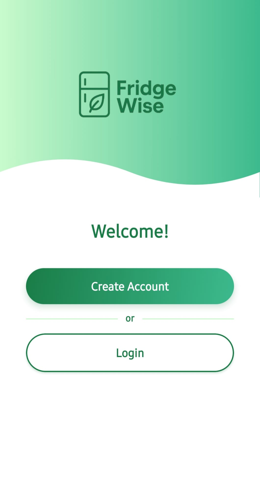
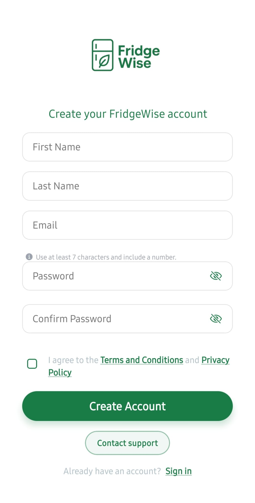
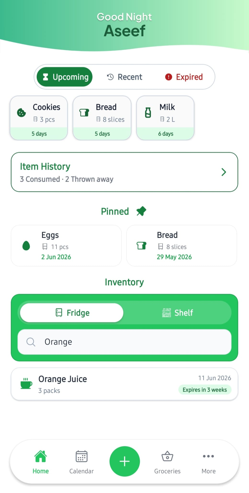
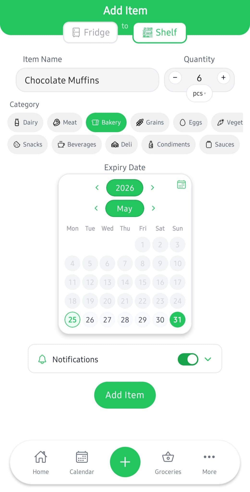
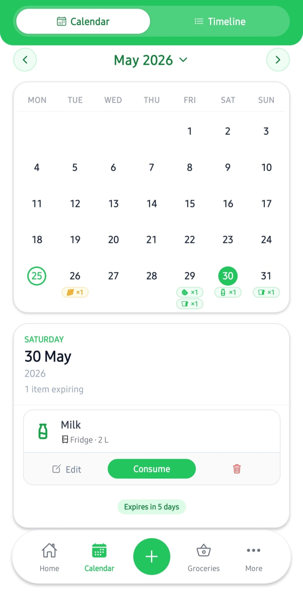

<h1 align="center">FridgeWise</h1>

<p align="center">
  A cross-platform mobile app for tracking food items, expiry notifications, and grocery lists.
</p>

---

## Overview

FridgeWise helps users manage the food they already have at home and reduce waste from forgotten items. It keeps food items, expiry dates, notifications, and grocery planning in one app, so users can see what they have, what needs attention, and what they may need to buy next.

The app is designed around everyday kitchen tasks: adding food items, checking upcoming expiries, updating item status, setting notifications, and reviewing basic food usage reports.

## Screenshots

<table align="center">
  <tr>
    <td align="center">
      
      <br />
      <sub>Welcome</sub>
    </td>
    <td align="center">
      
      <br />
      <sub>Create Account</sub>
    </td>
    <td align="center">
      
      <br />
      <sub>Home</sub>
    </td>
  </tr>
</table>

<table align="center">
  <tr>
    <td align="center">
      
      <br />
      <sub>Add Item</sub>
    </td>
    <td align="center">
      
      <br />
      <sub>Calendar</sub>
    </td>
  </tr>
</table>

## Features

### Food Tracking

- Add food items with quantity, expiry date, location, and reminder settings
- Track fridge and shelf items separately
- Edit item details when something changes
- Mark items as consumed or thrown away
- Extend expiry dates when needed

### Expiry Notifications

- View upcoming expiries in weekly and calendar views
- Set custom reminder times and repeat options
- Schedule local notifications for food items

### Grocery List

- Keep a grocery list separate from current inventory
- Add grocery items as needed

### Reports and Account

- Review consumption and waste reports
- Sign in with Supabase authentication
- Manage password, app data, and account deletion from settings

## Tech Stack

| Area | Technology |
| --- | --- |
| Mobile app | React Native, Expo |
| Language | TypeScript |
| Backend and auth | Supabase |
| Email | SendGrid |
| Testing | Jest |

## Database

The app uses Supabase for backend data and authentication. Database schema details are available on request.

## Getting Started

Install dependencies:

```bash
npm install
```

Create a `.env` file in the project root:

```bash
EXPO_PUBLIC_SUPABASE_URL=
EXPO_PUBLIC_SUPABASE_ANON_KEY=
EXPO_PUBLIC_RESET_REDIRECT_URL=
EXPO_PUBLIC_RESET_WEB_REDIRECT_URL=
```

Start the development server:

```bash
npm run start
```
